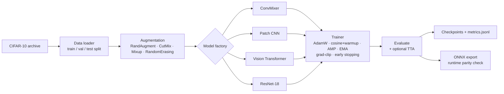

# CIFAR-10 Architecture Benchmark 🖼️🧠

A clean, **config-driven PyTorch framework** for training and **fairly comparing four
image-classification architectures** — ConvMixer, a patch-based CNN, a Vision
Transformer, and ResNet-18 — on CIFAR-10 under one shared, modern training recipe.
Built as an M.Tech ML project, engineered like production code: reproducible,
tested, and deployment-ready (ONNX).


---

## The goal

CIFAR-10 is small (50k 32×32 images) — which makes it a sharp testbed for a real
question: **how do fundamentally different vision architectures compare when each is
trained under the *same* modern recipe and the *same* augmentation budget?**

A CNN, a convolution-based patch mixer, and a Transformer all bring different
inductive biases. Transformers are data-hungry and notoriously hard to train on
small datasets; CNNs have strong spatial priors. This project isolates the
architecture variable by holding the training pipeline constant, so the comparison
is apples-to-apples rather than a tuning contest. Everything is config-driven and
seed-controlled so results are reproducible and the codebase doubles as a clean
template for future experiments.

## Pipeline



## Models compared

| Model | Config | Idea |
|---|---|---|
| **ConvMixer** | `configs/default.yaml` | Patch embedding + depthwise/pointwise conv mixing — CNN simplicity with a patch-based design. |
| **Patch CNN** | `configs/patch_cnn.yaml` | A convolutional baseline operating on image patches. |
| **Vision Transformer** | `configs/vit.yaml` | Patch embeddings + self-attention encoder — the data-hungry contender. |
| **ResNet-18** | `configs/resnet18.yaml` | Classic residual CNN baseline, adapted for 32×32 inputs. |

Switch architectures by swapping `--config` — the training recipe stays identical.

## The shared training recipe

Every model is trained with the same modern, well-regularised setup (see
`configs/default.yaml`), which is exactly what makes the comparison fair:

| Choice | Setting | Why |
|---|---|---|
| Optimiser | AdamW (lr 1e-3, wd 5e-3) | Decoupled weight decay; works well for both CNNs and Transformers. |
| Schedule | Cosine decay + 5-epoch warmup | Warmup stabilises early Transformer training; cosine anneals cleanly. |
| Regularisation | RandAugment, CutMix, Mixup, RandomErasing, label smoothing 0.1 | Small dataset + data-hungry ViT demand heavy augmentation to avoid overfitting. |
| Stability | Gradient clipping, AMP (mixed precision), EMA (0.9999) | Faster/cheaper training; EMA weights generalise better at eval time. |
| Honesty | Early stopping (patience 10), fixed seed, held-out val split | Reproducible, no test-set leakage in model selection. |

## Results

Run the full recipe (≥ 50 epochs) and record test accuracy here — the harness
prints final + (optional) TTA accuracy and logs per-epoch metrics to
`checkpoints/<model>_metrics.jsonl`:

| Model | Params | Test acc. | TTA acc. |
|---|---|---|---|
| ConvMixer | — | — | — |
| Patch CNN | — | — | — |
| Vision Transformer | — | — | — |
| ResNet-18 | — | — | — |

> _Populate from your own runs — see [How to run](#how-to-run). Parameter counts
> are printed at the start of training (`Model: <name> | Params: X.XXM`)._

## Setup

```bash
git clone https://github.com/Ayush21-AI/ML_MTech_Project.git && cd ML_MTech_Project

python -m venv .venv && source .venv/bin/activate
pip install -e ".[dev]"

# CIFAR-10 dataset (place the archive in the project root)
curl -O https://www.cs.toronto.edu/~kriz/cifar-10-python.tar.gz
```

Runs on **Apple Silicon (MPS)**, **CUDA**, or **CPU** — auto-detected, in that order.

## How to run

**Sanity-check the install (no dataset needed for most tests):**
```bash
pytest
```

**Smoke test — full pipeline on 500 images in ~1 minute:**
```bash
python -m cifar10_models \
  --config configs/default.yaml \
  --override data.fast_dev_run=true \
  --override data.fast_dev_size=500 \
  --override epochs=1 \
  --override data.num_workers=0 \
  --export-onnx --test-tta
```
Trains ConvMixer on a tiny subset, evaluates, runs test-time augmentation, and
exports `checkpoints/convmixer.onnx` — a quick end-to-end verification.

**Train a model for real:**
```bash
python -m cifar10_models --config configs/default.yaml      # ConvMixer, 50 epochs
python -m cifar10_models --config configs/vit.yaml          # Vision Transformer
# (the installed console script `cifar10-train --config ...` works too)
```

**Override any config value from the CLI:**
```bash
python -m cifar10_models --config configs/default.yaml \
  --override epochs=100 --override data.batch_size=64 --override optimizer.learning_rate=5e-4
```

**Multi-GPU (distributed) training:**
```bash
torchrun --nproc_per_node=2 -m cifar10_models --config configs/resnet18.yaml --distributed
```

**Explore in notebooks:**
```bash
jupyter notebook notebooks/CIFAR_EDA.ipynb      # exploratory data analysis
jupyter notebook notebooks/CIFAR_Models.ipynb   # training walkthrough
```

## CLI reference

| Flag | Purpose |
|---|---|
| `--config <path>` | YAML config to load (**required**) |
| `--override key=value` | Override any nested config value (repeatable, e.g. `model.name=vit`) |
| `--export-onnx` | Export the trained model to ONNX with a runtime parity check |
| `--test-tta` | Evaluate with test-time augmentation |
| `--distributed` | Multi-GPU mode (launch with `torchrun`) |

## Outputs

- **Checkpoints:** `checkpoints/<model>_best.pt`, `checkpoints/<model>_last.pt`
- **Metrics log:** `checkpoints/<model>_metrics.jsonl` (per-epoch loss/accuracy/LR)
- **ONNX model:** `checkpoints/<model>.onnx` (with `--export-onnx`)
- **Resolved config:** `checkpoints/config.yaml` (the exact run configuration)

## Project structure

```
ML_MTech_Project/
├── configs/                     # YAML training configs (one per architecture)
│   ├── default.yaml             # ConvMixer (also the base recipe)
│   ├── patch_cnn.yaml · vit.yaml · resnet18.yaml
├── notebooks/
│   ├── CIFAR_EDA.ipynb          # exploratory data analysis
│   └── CIFAR_Models.ipynb       # training walkthrough
├── src/
│   ├── cifar10_eda/             # EDA package (data loading, viz, utils)
│   └── cifar10_models/          # training package
│       ├── cli.py · train.py · evaluate.py · export.py
│       ├── data.py · augmentation.py · optim.py · metrics.py
│       ├── callbacks.py · distributed.py · config.py
│       └── models/              # convmixer · patch_cnn · vit · resnet + factory
├── tests/                       # 17-test pytest suite
└── pyproject.toml
```

## Tech stack

PyTorch · torchvision · torchmetrics · NumPy · pandas · matplotlib · PyYAML ·
ONNX / ONNX Runtime · tqdm · pytest · (optional) Weights & Biases · MLflow

## Engineering highlights

- **Config-driven & reproducible** — every run is fully specified by a YAML file
  plus seed; CLI `--override` makes sweeps trivial and keeps the comparison fair.
- **Modern training recipe** — AdamW, cosine+warmup, AMP, EMA, gradient clipping,
  CutMix/Mixup/RandAugment, label smoothing, early stopping.
- **Deployment-ready** — ONNX export with a Torch↔ONNX-Runtime parity check.
- **Scales out** — distributed (DDP) scaffolding wired in for multi-GPU runs.
- **Tested** — a pytest suite covering config, data loading, models, training,
  and export, with a `fast_dev_run` mode for quick end-to-end checks.

---

*M.Tech machine-learning project by Ayush Gour — an architecture comparison built
with production-grade engineering practices.*
